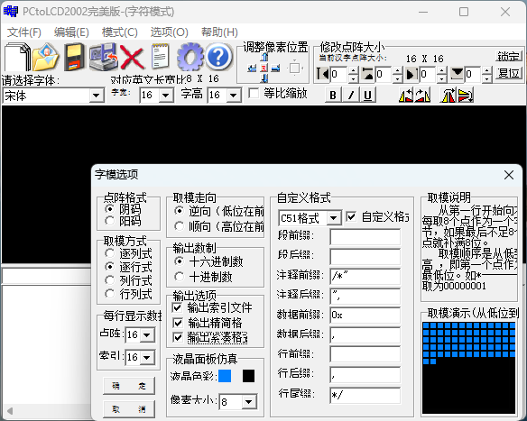
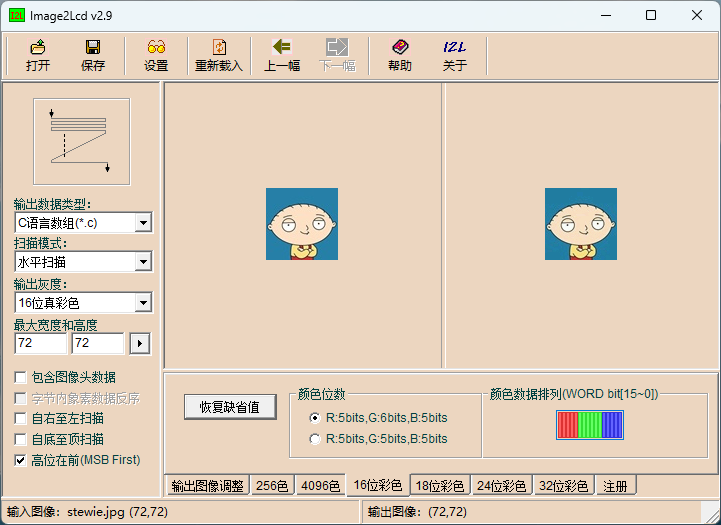

# ST7796屏幕 STM32 驱动+例程
仓库正在整理上传......有问题可以联系[我B站](https://space.bilibili.com/2004315025)或者发邮件到mrwei95@outlook.com。
## 驱动说明
* 改自中景园提供的例程，原例程驱动使用GB2312编码 + 软件模拟SPI。
* 本驱动屏幕使用硬件SPI通讯，目前没加DMA。
* 例程使用STM32F103ZET6 + 3.5寸LCD屏幕(480x320)验证可行性。
* 驱动使用UTF-8编码，**由于中文在UTF-8(3字节)和GB2312(2字节)中存储大小不通，请勿转换文本编码！**

## 字符、图像取模说明
### 字符取模

### 图像取模

